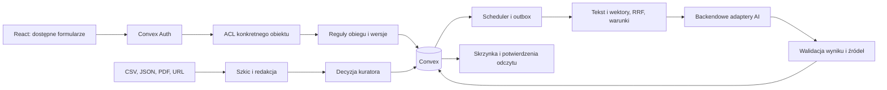

# Architektura Splot dla HubMI

Autor: Michał Kiełtyka, DEFOZO SOFTWARE HOUSE, na podstawie potwierdzonego `TEAM.json`. Zespół ma jednego członka. Kod własny, biblioteki oraz zewnętrzne usługi są oddzielone w wykazie zależności i rejestrze źródeł. Dokument opisuje wykonaną architekturę prototypu; nie stanowi potwierdzenia produkcyjnej tożsamości ROPS, rzeczywistych partnerstw ani jakości merytorycznej scenariuszy syntetycznych.

React i Vite korzystają z jednego backendu Convex w regionie `eu-west-1`. Logowanie obsługuje Convex Auth. Klient otrzymuje publiczny adres deploymentu; klucze modeli i administracji pozostają w psst oraz backendowych zmiennych środowiska. Serwowanie statycznego frontendu przez `staticSite.ts` używa manifestu zatwierdzonego z uprawnieniami deploymentu. Prywatne załączniki mają osobny, uwierzytelniony przepływ i nie występują w tym manifeście.

**Model danych i odpowiedzialność plików**

`convex/schema.ts` definiuje tabele Auth, profile, prywatne rekordy procesu, publiczną wiedzę, źródła, rewizje, dopasowania, powiadomienia, outbox, zadania, audyt, pliki, liczniki AI i metadane. `records` jest wspólną kopertą domenową: `kind`, właściciel, członkowie, status, wersja i dane. `hub.ts` dopuszcza osobny zestaw pól dla każdego rodzaju, waliduje reguły i sam nadaje pola zaufane. Klient nie zapisuje właściciela, roli, zgód partnera, przyjętej migawki ani zatwierdzeń.

| Obszar | Tabele i pliki | Zachowanie |
| --- | --- | --- |
| Tożsamość | `auth.ts`, `auth.config.ts`, `profiles`, `lib/acl.ts` | Rejestracja nadaje wyłącznie rolę mieszkańca. Zaufany seed nadaje role demonstracyjne. Redakcja i trendy mają odrębne uprawnienia operatora; administrator ma oba. |
| Dostęp do spraw | `records`, `recordAccess`, `hub.ts` | Autor, jawnie przypisany uczestnik lub opiekun. Indeks dostępu obsługuje listowanie i paginację; każdy odczyt ponownie sprawdza członkostwo. |
| Wiedza | `sources`, `knowledge`, `knowledgeChunks`, `knowledge.ts` | Szkic, przegląd, kompletny indeks, publikacja, wycofanie i audytowane przywrócenie. Nowa edycja publikacji tworzy osobną wersję. Fragmenty przechowują lokatory, źródła i model embeddingu. |
| Import | `knowledge.importData`, `imports.ts`, `domain/ocr.ts` | JSON/CSV walidowane w całości przed zapisem. PDF zachowuje numery stron; skan wymaga osobnej zgody na OCR. URL wymaga HTTPS, allowlisty, kontroli DNS, przekierowań i rozmiaru. |
| Dopasowanie | `matching.ts`, `search.ts`, `ai.ts`, `domain/matching.ts` | Osobne pule innowacji i informacji, tor słownikowy i wektorowy, RRF, źródła, trzy stany warunków, istotne pytanie, abstencja. |
| Potrzeby | `records(kind=need)`, `matches`, `matching.ts` | Oryginał, interpretacja, zasoby, świadome obserwowanie, cisza, wersja i monotoniczna rewizja dopasowania. |
| Pomysły i nabory | `hub.ts`, `grants.ts`, `grantTransactions.ts` | Fiszka, Canwa, dwa różne schematy, szkic wniosku i atomowe przyjęcie po walidacji Ajv w Node action. |
| Usługi i zasoby | `records(kind=card/offer/partnership)`, `domain/rules.ts` | Przypięte wersje, obliczenia groszy, odrębne akceptacje autora i opiekuna, weryfikacja eksperta, atomowe rezerwacje. |
| Pilotaże | `records(kind=pilot/enrollment/feedback)` | Rekrutacja, zgoda, przyjęcie, limit miejsc, wycofanie, zadania, ocena i pomiar przed/po. Wynik przypisany do wersji Karty. |
| Komunikacja | `records(kind=thread/message)`, `notifications`, `outbox` | Prywatne wątki, jawni odbiorcy, odpowiedzi, per-user odczyt wiadomości, powiadomienia w aplikacji. |
| Pliki | `files.ts`, `fileActions.ts` | Upload, kwarantanna, kontrola typu i aktywnej treści, ACL każdego pobrania. Przyjęty wniosek ma niezmienne załączniki. |
| Operacje | `jobs.ts`, `crons.ts`, `privacy.ts`, `demoReset.ts`, `operations.ts` | Dostarczenie outbox, ważność ofert, terminy naborów, retencja danych tymczasowych, usuwanie prywatnego obszaru, reset demo, eksport. |

**Uprawnienia i projekcje publiczne**

Biblioteka, aktywne oferty, opublikowane nabory i publiczny opis pilotażu są dostępne bez konta. Pozostałe obiekty wymagają sesji i prawa do konkretnego rekordu. Ekspert widzi przypisane sprawy. Uczestnik pilotażu otrzymuje zadania i własną opinię, bez cudzych opinii i bez prywatnej migawki Karty. Dane osobowe mieszkańców nie są publicznym katalogiem kontaktów. Trendy są oddzielnym serwerowym odczytem dla administratora lub operatora z `trends:read`, z deduplikacją, okresem 30 dni i ukryciem liczebności poniżej pięciu.

`hub.list` łączy indeks właściciela z indeksem przypisań, aby duża liczba cudzych spraw nie przesłoniła starszej własnej sprawy. `hub.page` udostępnia paginację. `seed.rebuildAccess` służy do uzupełnienia indeksu po migracji lub odtworzeniu. Spójność indeksu przy zapisie i przydziale zapewnia `syncAccess`; sam indeks nie zastępuje kontroli ACL.

Biblioteka używa `knowledge.page` z kursorem Convex. Filtr rodzaju i zakres publikacji są częścią indeksu przed pobraniem strony; wyszukiwanie ma ten sam filtr. API zwraca `isDone` i `hasMore`, bez udawania, że liczba wczytanych rekordów oznacza całą bibliotekę. Relacje pilotażu, oferty, Karty, rozmowy i naboru korzystają z indeksów po ich identyfikatorach, a nie ze skanowania wszystkich rekordów danego rodzaju. Integralność i deduplikacja treści używają SHA-256.

**Mapa wskaźników**

Mapa pobiera `knowledge.indicators`: wyłącznie opublikowane materiały rodzaju `map` z aktualnymi publicznymi źródłami. `metadata.indicators` zawiera tablicę `{name, territory, year, unit, value, latitude?, longitude?, note?}`. Backend odrzuca niepełny rok, jednostkę, wartość lub parę współrzędnych. Interfejs grupuje wskaźnik, rok i jednostkę; punkty są orientacyjne, a równoważna tabela zawiera wszystkie dane, również pozycje bez współrzędnych. Jawny limit odczytu wynosi 100 materiałów i jest oznaczany przy obcięciu. `seed.regionalIndicators` w wydzielonym demo tworzy trzy fikcyjne wartości z własnym źródłem `/sources/demo-map.html`; nie są danymi ROPS ani pomiarem sytuacji miast. Import JSON i edytor administratora pozwalają wprowadzić właściwe dane po zatwierdzeniu praw i treści.

**Filmy i edukacja**

`seed.demoMedia` jest idempotentnym, wewnętrznym seedem ograniczonym do właściwego projektu demo. Tworzy osobne materiały `video` i `course` oraz wspólne źródło `/sources/demo-video.html`. Oba materiały przechodzą kolejkę indeksowania przed publikacją. `metadata.videoUrl`, `vttUrl` i `transcript` uruchamiają odtwarzacz z napisami oraz opis tekstowy; `metadata.steps` udostępnia kurs w postaci uporządkowanej listy. Pliki MP4, WebVTT i tekst są statycznymi publicznymi materiałami autora, oddzielonymi od prywatnych załączników spraw. Zmiana opublikowanych metadanych wymaga nowej wersji materiału. Film i kurs mają źródło, autora, licencję, wersję i oznaczenie danych syntetycznych. Funkcja tworzenia Karty jest dostępna z innowacji; materiały edukacyjne prowadzą do opisu własnej potrzeby lub konsultacji.

Redakcja i analiza trendów są osobnymi uprawnieniami profilu: `knowledge:edit` oraz `trends:read`. Administrator ma pełen dostęp; operator wymaga jawnego przydziału konkretnego uprawnienia. Sprawdzenia obejmują szkice, importery, publikację po zakończeniu zadania i statystyki. Interfejs nie uruchamia zapytań ani nie pokazuje zakładek bez danego uprawnienia. Analityk trendów otrzymuje agregaty, bez surowych zadań i audytu administratora.

**Publikacja i źródła**

Publikacja wymaga zakończenia redakcji i wyjaśnionych praw do źródła. Materiał przechodzi do stanu indexing i pozostaje prywatny do przygotowania wszystkich fragmentów. knowledgeChunks zapisuje lokator strony/sekcji, hash, źródła, wersję oraz embedding. Stage oblicza oczekiwaną liczbę fragmentów na serwerze; commitPublication sprawdza ich kompletność i źródła, po czym atomowo przełącza zakres fragmentów i dokumentu na publiczny, zastępuje poprzednią wersję i zwiększa wersję korpusu. Błąd pozostawia starą publikację; redaktor widzi zadanie i może ponowić przygotowanie. Identyczne fragmenty ponownie korzystają z wektora wyłącznie przy zgodnym tekście i modelu. Wycofanie źródła jest skuteczne od razu dzięki ponownemu sprawdzaniu `source.status` przy publicznym odczycie i walidacji rekomendacji. Zadanie partiami usuwa związane materiały z zakresu wyszukiwania. Osobne przywrócenie źródła wymaga uzasadnienia, a przywrócenie wersji materiału zostaje w audycie.

PDF bez dostatecznej warstwy tekstowej zwraca `needs_ocr`, zanim uruchomi dostawcę. Dopiero `allowOcr: true` i `ocrConsent: true` uprawnionego operatora pozwalają przetworzyć maksymalnie 10 stron i 5 MiB. OCR zachowuje numery stron, wersję promptu, model, koszt i oznaczenie koniecznego przeglądu człowieka. Nie publikuje automatycznie szkicu. Data publikacji źródła jest oddzielna od daty pobrania; nieznana pozostaje pusta, a korekta tworzy nową wersję źródła.

Zmiana korpusu zwiększa `corpusVersion`. Zatwierdzona Karta zachowuje przypięte źródła i wersję, otrzymuje informację o wymaganym przeglądzie. Nowa wiedza nie zmienia wstecz planu ani pomiarów trwającego pilotażu. Własny korpus demonstracyjny jest oznaczony jako syntetyczny, z dowodami na poziomie koncepcji. Nie jest przedstawiany jako biblioteka zweryfikowanych rozwiązań ROPS.

**Obserwowanie i zadania**

Włączenie obserwowania najpierw ustala bazowy wynik. Publikacja, istotna zmiana lub wycofanie uruchamiają ponowne dopasowanie. Każde zadanie ma wersję potrzeby, `matchRevision` i docelowy korpus. Commit odrzuca spóźnioną odpowiedź, zmienioną potrzebę, utraconą zgodę i nieaktualne źródła. Wynik i outbox zapisują się atomowo. Dostarczenie jeszcze raz sprawdza zgodę, ciszę, rewizję i korpus, a klucz zdarzenia eliminuje duplikaty.

Awaria modelu pozostawia zapisane szkice, katalog, wyszukiwanie słownikowe, nabory i komunikację. Budżety dzienne, miesięczne i sesyjne są rezerwowane po stronie serwera, a rzeczywiste zużycie uzgadniane po wywołaniu. Akcje mają skończoną liczbę prób. Nie zapisujemy pełnych prywatnych promptów w logach. Wyniki AI są propozycjami, nie decyzjami o publikacji, finansowaniu, partnerstwie lub rozpoczęciu testu.

**Wnioski, akceptacje i wspólne zasoby**

Złożenie wniosku przechodzi przez `grants.submit`. Action pobiera zaufany schemat i waliduje dane; wewnętrzna mutacja sprawdza ponownie autora, aktualny hash, wersję schematu, terminy, budżet i idempotencję. Powstają numer i niezmienna migawka. `hub.transition` nie udostępnia skrótu omijającego tę walidację. Status w HubMI, przekazanie do symulatora i potwierdzenie symulatora są rozdzielone; żaden nie oznacza otrzymania grantu.

Nowa Canwa otrzymuje po stronie serwera `canvasTemplateVersion: demo-1`. Wersja szablonu pozostaje przypisana do danych i historii edycji; klient nie może podmienić jej własną wartością. Szablon jest własną demonstracją, nie planszą ROPS.

Kartę zatwierdzają dwie różne osoby: autor instytucjonalny i opiekun. Zmiana merytoryczna wymaga przypisanego eksperta. Zapis nowej treści unieważnia akceptacje; trwający test nie pozwala edytować przypiętej wersji w miejscu. Kosztorys liczy grosze, a brak ceny daje niepełny kosztorys. Deklaracja zasobu nie może podszyć się pod potwierdzenie eksperta lub partnera.

Przyjęcie partnerstwa wykonuje właściciel oferty. Transakcja sprawdza wersję, termin ważności, zakres czasu i pojemność w każdym fragmencie nakładających się rezerwacji. Warunek liczbowy wymaga odpowiedniej sumy faktycznie zarezerwowanych jednostek. Wycofana lub wygasła oferta oznacza konflikt. Wznowienie wymaga ponownego potwierdzenia partnerstwa i zatwierdzenia warunków przez opiekuna.

Przed `running` backend kontroluje obowiązkowe warunki, aktualność przeglądów, rezerwacje obejmujące cały test oraz zgodność wersji Karty. Uczestnik ocenia użyteczność, zgłasza bariery i poprawki. Podsumowanie rozdziela liczbę zgłoszeń, przyjętych, odpowiedzi i rezygnacji. Kurator zatwierdza oczyszczony opis i ograniczenia. Dopiero osobna publikacja redakcyjna upowszechnia doświadczenie. Porównanie przed/po nie otrzymuje etykiety dowodu przyczynowego.

Tworzenie i akceptacja Karty oraz start pilotażu ponownie sprawdzają rzeczywisty status przypiętej innowacji i źródeł. Przegląd źródła musi obejmować cały planowany test. Klient nie może skasować `sourceReviewRequired` zwykłym zapisem. `review_sources` wymaga opiekuna, odczytanej wersji i uzasadnienia; zachowuje przypięty plan, zapisuje decyzję oraz wymaga ponownych akceptacji autora i opiekuna. Wycofana lub zastąpiona innowacja kieruje do utworzenia nowej Karty z aktualnej publikacji.

**Przechowywanie, usuwanie i odtworzenie**

`files.generateUploadUrl` wymaga prawa do sprawy. `files.quarantine` rejestruje faktyczny typ i rozmiar magazynu, blokuje przypięcie istniejącego pliku do innej sprawy i wymusza kwarantannę. `fileActions.scan` sprawdza format, sygnaturę i niedozwoloną aktywną treść. Ten mechanizm jest kontrolą treści prototypu, nie produkcyjnym skanerem antywirusowym. Prywatne pobranie zwraca zawartość dopiero po sprawdzeniu sesji i ACL, bez trwałego publicznego URL. Limity: tekst/PDF/PNG 5 MiB, audio 10 MiB.

Codzienna retencja usuwa niepowiązane wyniki anonimowe po 24 godzinach, niepowiązane wyniki kont po 30 dniach i wygasły cache. Powiązane, zatwierdzone sprawy nie są kasowane przez tę regułę. `privacy.eraseMyData` wymaga wpisania `USUŃ MOJE DANE` i kolejkuje usunięcie prywatnego obszaru autora wraz z rewizjami, plikami, dopasowaniami, powiadomieniami i kopiami tymczasowymi. Konto pozostaje aktywne. Obce zależne plany dostają stan wymagający przeglądu i tracą usunięte prywatne migawki. Publiczna wiedza oraz minimalny dziennik operacji pozostają zachowane. Konta operatorów wymagają uprzedniego przekazania opieki. Retencja kopii i uzgodnienie obowiązków instytucji pozostają osobną konfiguracją właściciela danych.

`internal.demoReset.reset` przyjmuje tylko potwierdzenie `RESET SPLOT DEMO` i wymaga backendowych `APP_ENV=demo`, `APP_PROJECT=splot-hubmi`. Reset usuwa dane scenariuszy i ich pliki, zachowuje konta oraz statyczny frontend, po czym uruchamia idempotentny seed. Nie jest operacją produkcyjną. Kopia i odtworzenie są obsługiwane przez `scripts/backup-restore.mjs`: eksport bazy z plikami, import do oddzielnego deploymentu i kontrola autoryzowanego oraz odrzuconego odczytu po odtworzeniu.

Wynik wykonanej próby odzyskiwania oraz zakres testów opisuje [VALIDATION.md](VALIDATION.md).

**Kontrakty interfejsu**

| Funkcje | Główne argumenty i rezultat |
| --- | --- |
| `hub.me`, `hub.people` | Profil z sesji i bezpieczny katalog kontaktów do przypisań. |
| `hub.list`, `hub.page`, `hub.get` | Rodzaj/ID i paginacja; uprawniony rekord, historia albo publiczna projekcja. |
| `hub.save` | `kind`, `title`, `data`, opcjonalne `id` i `expectedVersion`; zwraca ID zapisanego dokumentu. |
| `hub.transition` | `id`, `action`, opcjonalne `data`; reguły zależne od rodzaju i aktualnego stanu. |
| `hub.assign` | ID sprawy i uprawnionego eksperta lub opiekuna. |
| `knowledge.list/page/get/save/transition` | Publiczny katalog, strony z kursorem, szczegóły ze źródłami, redakcja i decyzje publikacyjne. |
| `knowledge.withdrawSource/restoreSource` | Wycofanie źródła i audytowane przywrócenie z uzasadnieniem. |
| `knowledge.importData`, `imports.importUrl/importPdf` | Idempotentny wsad, zatwierdzony URL albo PDF z warstwą tekstową lub świadomym OCR; rezultat pozostaje szkicem. |
| `knowledge.indicators`, `seed.regionalIndicators/demoMedia` | Publiczne wskaźniki z metadanymi oraz idempotentne wewnętrzne seedy mapy, filmu i kursu, ograniczone do demo. |
| `matching.match`, `ai.assist` | Ustrukturyzowane propozycje z ograniczeniami, źródłami, modelem, kosztem i wersjami. |
| `grants.submit` | ID szkicu i klucz idempotencji; niezmienny wniosek z numerem. |
| `hub.notifications/markRead`, `hub.pilotResults` | Własna skrzynka, odczyt i uprawnione podsumowanie testu. |
| `files.*`, `fileActions.*` | Osobny cykl uploadu, kontroli i prywatnego pobrania. |
| `operations.exportRecord/auditFor/health` | Kontrolowany eksport i audyt obiektu, publiczny stan aplikacji. |

Produkcja wymaga uzgodnionego SSO/odzyskiwania kont, oficjalnej biblioteki i Canw ROPS, zewnętrznego API grantowego, produkcyjnego skanowania plików, zasad retencji i przetwarzania przez dostawców modeli. Prototyp realizuje te przepływy na jawnych schematach i danych demonstracyjnych. Odbiór instytucjonalny obejmuje ocenę merytoryczną, testy z odbiorcami i używanymi przez nich technologiami asystującymi.
